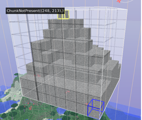

# Minecraft Sever（Lite version）  
## 前言
本题希望您能开发一个只有极其精简功能的我的世界服务端，假如您不熟悉我的世界这款游戏，也没有关系，本题不涉及我的世界这款游戏本身的代码，对于一些游戏中一些概念也会给予解释。所以是否玩过这游戏并不影响您做题的过程。在正式开始本题之前，我们希望您做到以下几点。  
+ 分阶段实现基本的客户端服务端通信。具体要求会在下文中提出。
+ 有充分的、有条理的、尽可能简明规范的注释。
+ 学会自己在网络上查找合适的文档资料并自主学习完成。这份教程没有给出充分的实现细节，这旨在驱动大家自己动手充分利用互联网获取自己想要的信息。
+ 编写一份简明的文档，列出主要函数的调用方式、参数信息、重要注释等。
+ 如果实现全部的功能比较困难，可以只实现部分。我们最终考察的并非只是题目的完成度，更多的是考察学习能力和态度。  
下面是一些额外的要求，希望大家尽量去做：
+ 使用 Golang 语言。当然，如果你没有任何 Golang 基础，可能会比较困难，那么你可以使用其他你较为熟悉的语言。如果你对 Golang 非常熟悉，那么可以试试其他你没那么熟悉的语言，比如 Java 等。这条是希望大家在能力范围内勇于使用自己舒适区外的语言，同时学会查阅语言文档。
+ 规范化编程。规范化的编程不仅可以增加代码的可读性，还可以避免一些意料之外的
bug。
+ 模块化编程。模块化的编程便于调试，也可以使代码更易读。
## 参考文档
- [Git Documentation](https://git-scm.com/doc)
- [Git Tutorial](https://www.runoob.com/git/git-tutorial.html)
- [What is Secure Shell(SSH)](https://en.wikipedia.org/wiki/Secure_Shell)
- [Markdown Guide](https://www.markdownguide.org/basic-syntax/)
- [Markdown Tutorial](https://www.runoob.com/markdown/md-tutorial.html)
- [The Little Go Book](https://www.openmymind.net/assets/go/go.pdf)
- [TCP/IP Tutorial](https://www.runoob.com/tcpip/tcpip-protocols.html)
- [What is Hypertext Transfer Protocol(HTTP)](https://en.wikipedia.org/wiki/Hypertext_Transfer_Protocol)
- [HTTP Tutorial](https://www.runoob.com/http/http-tutorial.html)
- [Minecraft Protocol](https://wiki.vg/Protocol)

## 基本介绍
对于我的世界这款游戏本身您可以通过这个[视频](https://www.bilibili.com/video/BV1zL411G7dZ)大概了解一下。游戏本身是玩家操控游戏内人物在一块自由世界内探索。
在我的世界这款游戏中，您可以连接到服务器与世界上的其它玩家联机游玩。客户端与服务端的通信是借助 TCP/IP 协议实现的（在您接下来实际的答题过程中，你可以自行选择是只使用 TCP/IP 还是用 HTTP）。在客户端和服务端建立起连接之后，以每秒 20 次发送数据包，使得客户端与服务端内数据同步。当然你可能已经发现这个频率并不是足够高，假如客户端只是被动的等待服务端返回信息后才确定接下来发生的事情，这对于玩家来说会有明显的卡顿感。所以事实上客户端和服务端是相互独立运作的。例如当玩家向前行走时，客户端会先判断前方是否有物品阻挡，假如没有物品阻挡（此时是用客户端已有的数据判断），就允许玩家向前行走（即改变玩家的坐标）。与此同时也有一份数据包发往服务端，服务端同样判断玩家前方是否有物品阻挡（此时是用服务端的数据判断），假如服务端判断有物品阻挡，则发送一份数据包到客户端，将玩家拉回原来的坐标。

## 流程介绍
### 建立连接   
推荐使用 25565 端口建立一个 TCP/IP 连接。您可以与自己的本地或者舍友的电脑连接。
### 登录
在登录之前，要先确定玩家的版本是否正确，在这里我们假设服务器的游戏版本号为1.12.2，服务器需要拒绝与非这个版本号的连接。（在真实的我的世界服务器中，这个过程是在“握手”环节完成的）  
在服务端需要储存一份有关玩家的数据，即包括玩家在游戏内的名称，登录密码，坐标（即玩家在世界中的位置）。登陆时比对玩家登录密码是否正确，假如正确的则返回玩家的所有信息以及地图有关的信息，不正确则断开此次连接。（假如你玩过我的世界的话你会知道这个过程并非如此，但我们在此简化了这个过程）
### 地图
在我的世界中，整个世界是由方块构成的，而地图存储先将整个世界划分成一个8x8 的区块（chunk），先存储区块的信息，然后每个区块内存储方块的信息。我们将整个流程简化，只存储一个 8x8x8 大小的区域的信息（假如您认为太麻烦，也可以只储存 8x8 的信息，将三维的判断变成二维的判断），在这个区域内填充满方块，但有部分方块属于空气方块（air）（即玩家可以穿过的方块，或者说用这个方块代表这个地方还没有被别的方块所占用），其余的方块我们全部填充为石头（stone）。(下图是一个示意图)  

### 移动
如在基本介绍中的那样，实现一个玩家移动的功能，将坐标信息存入服务器内的数据库内。当然这里面还有许多问题，我们先定义当键盘键入WASD时分别为前进往左后退和往右（对于二维地图的话则是上下左右），但是游戏内行走的过程是连续发生的，当按住某个键的时候游戏内人物以某个固定的速度往某个方向前进。考虑到时间的问题，您也可以选择进一步简化这个过程，例如改为键入一次W时，某个坐标值就+1/-1，关于这个问题可以自行选择解决的方案。关于整个过程的具体表现形式可以自行决定，可以有图形化的界面，也可以只是服务器内的数据发生改变。
### 断开连接
 请您自行设计一个方式，使得客户端和服务端可以断开连接，并且上传断开前玩家的数据。
## 总结与反思
在文档中，需要你在开头或者结尾部分回答下列问题：
+ 你觉得解决这个任务的过程有意思吗？
+ 你在网上找到了哪些资料供你学习？你觉得去哪里/用什么方式搜索可以比较有效的获得自己想要的资料？
+ 在过程中，你遇到最大的困难是什么？你是怎么解决的？
+ 完成任务之后，再回去阅读你写下的代码和文档，有没有看不懂的地方？如果再过一年，你觉得那时你还可以看懂你的代码吗？
+ 其他想说的想法或者建议。
那么二面题就到这里了, 期待与你的见面~

以上。
