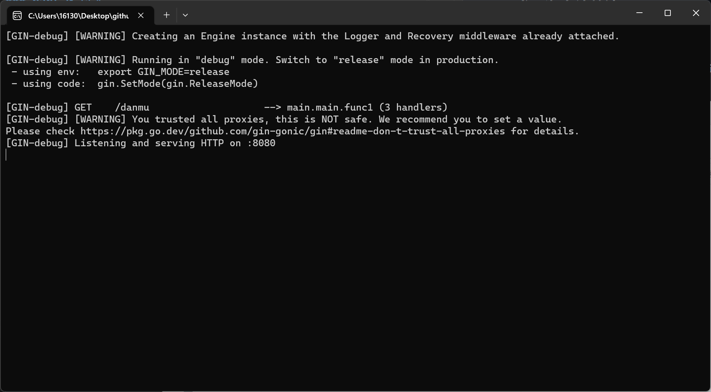

## 2023求是潮春纳前端题
### part 0 引入
在网上刷视频时，我们经常会看到各种各样的弹幕，这让我们看视频的过程充满了乐趣，现在，我们需要您来写一个弹幕系统。

我们希望您在本地利用我们的程序（danmu.exe文件）起一个虚拟的后端，并撰写前端进行交互，这个程序运行后后端将会在 http://localhost:8080/danmu 上（启动的时候可能会比较卡，请耐心等待，直到显示出如下的窗口）


我们还希望您在谈谈做完题之后的感想、收获、遇到的坑点……什么都可以！
### part 1 要求
您需要按照要求写一个具有如下功能的弹幕界面：
+ 包含一个黑色的框，模拟一个视频播放界面。
+ 有一个开始按钮，按下之后会以如下API向后端请求数据，并将请求到的弹幕数据以相应颜色在播放界面中从左到右滚动。
+ 有一个输入框和“发射”按钮，按下后输入框内的弹幕内容会以随机颜色显示在视频播放界面最右侧并滚动到左侧。
+ bonus:使用框架和包（react，vue或者别的均可）
+ **不要忘记写一份文档，谈谈您做完题之后想说的一切。**
#### API
##### 获取弹幕 [GET]
- resopnse
```
{
    "data":
    [{
        "rgb":string,
        "content":string,
    }]
}
```
#### 示例图片
##### 这是没有弹幕时的界面

##### 这是有弹幕时的界面

### part 2 可能能用到的参考资料
#### 假如您对前端了解甚少
[MDN](https://developer.mozilla.org/zh-CN/): Mozilla 基金会的开发者网络平台。提供了大量关于各种 HTML 、 CSS 和 JavaScript 功能的开放、详细的文档，以及广泛的 Web API 参考资料。

[现代 JavaScript 教程](https://zh.javascript.info/): MDN 中也有提供 JavaScript 相关的教程，您可以凭您的喜好选择。

关于和后端交互，您可以看看[这份文档](doc/%E4%B8%8E%E5%90%8E%E7%AB%AF%E4%BA%A4%E4%BA%92%E7%9B%B8%E5%85%B3%E6%96%87%E6%A1%A3.md)
#### 假如您需要使用框架和包
由于潮内的前端使用[node.js](https://nodejs.org/en/)，并配合npm（安装node.js时会附带安装）或[yarn](https://www.yarnpkg.cn/)使用，我们希望您也这么做。

关于使用的框架，您可以使用[react](https://zh-hans.reactjs.org/)，[Vue](https://cn.vuejs.org/)，或是别的框架。

### part 3 提交须知
如果您使用原生，您需要提交所有文件。

如果您使用了框架和包，请**不要交node_modules到仓库**，但其他的文件都需要交。

